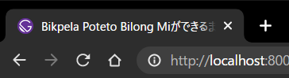

### ディレクトリ構造
アプリケーションルートからのディレクトリ構造は、以下のようになっています。（`node_modules`ディレクトリの中身は数が多いので省略します。）

```sh
$ tree -I "node_modules" --prune -L 3
.
├── LICENSE
├── README.md
├── content
│   └── assets
│       ├── gatsby-icon.png
│       └── profile-pic.jpg
├── gatsby-browser.js
├── gatsby-config.js
├── gatsby-node.js
├── package-lock.json
├── package.json
├── public
│   ├── favicon-32x32.png
│   ├── favicon.ico
│   ├── icons
│   │   ├── icon-144x144.png
│   │   ├── icon-192x192.png
│   │   ├── icon-256x256.png
│   │   ├── icon-384x384.png
│   │   ├── icon-48x48.png
│   │   ├── icon-512x512.png
│   │   ├── icon-72x72.png
│   │   └── icon-96x96.png
│   ├── index.html
│   ├── manifest.webmanifest
│   ├── render-page.js
│   ├── render-page.js.map
│   └── robots.txt
├── src
│   ├── components
│   │   ├── bio.js
│   │   ├── layout.js
│   │   └── seo.js
│   ├── normalize.css
│   ├── pages
│   │   ├── 404.js
│   │   ├── index.js
│   │   └── using-typescript.tsx
│   ├── style.css
│   └── templates
│       └── blog-post.js
└── static
    ├── favicon.ico
    └── robots.txt

9 directories, 35 files
```

このうち、アイコン関係は`./content/assets`に格納されている以下の2ファイルです。

```sh
$ tree ./content/assets
./content/assets
├── gatsby-icon.png
└── profile-pic.jpg

0 directories, 2 files
```

`gatsby-icon.png`がいわゆるファビコンというやつで、ブラウザのタブとかに表示されるアイコン的な画像のこと。



そして`profile-pic.jpg`が、プロフィール画像です。


ファビコンは今後作るとして、今回はプロフィール画像を変更しようと思います。

### Bioコンポーネント

上記のプロフィール画像と文章は、`Bio`として一つのコンポーネントにまとまっています。

```sh
$ tree ./src/components/
./src/components/
├── bio.js
├── layout.js
└── seo.js

0 directories, 3 files
```

`bio.js`を開くと、以下のようになっていました。

```js
/**
 * Bio component that queries for data
 * with Gatsby's useStaticQuery component
 *
 * See: https://www.gatsbyjs.com/docs/use-static-query/
 */

import React from "react"
import { useStaticQuery, graphql } from "gatsby"
import Image from "gatsby-image"

const Bio = () => {
  const data = useStaticQuery(graphql`
    query BioQuery {
      avatar: file(absolutePath: { regex: "/profile-pic.jpg/" }) {
        childImageSharp {
          fixed(width: 50, height: 50, quality: 95) {
            ...GatsbyImageSharpFixed
          }
        }
      }
      site {
        siteMetadata {
          author {
            name
            summary
          }
          social {
            twitter
          }
        }
      }
    }
  `)

  // Set these values by editing "siteMetadata" in gatsby-config.js
  const author = data.site.siteMetadata?.author
  const social = data.site.siteMetadata?.social

  const avatar = data?.avatar?.childImageSharp?.fixed

  return (
    <div className="bio">
      {avatar && (
        <Image
          fixed={avatar}
          alt={author?.name || ``}
          className="bio-avatar"
          imgStyle={{
            borderRadius: `50%`,
          }}
        />
      )}
      {author?.name && (
        <p>
          Written by <strong>{author.name}</strong> {author?.summary || null}
          {` `}
          <a href={`https://twitter.com/${social?.twitter || ``}`}>
            You should follow them on Twitter
          </a>
        </p>
      )}
    </div>
  )
}

export default Bio
```

### `bio.js`を構成するブロック

`bio.js`は、大きく分けて3つのブロックに分けられます。

まず最初のブロックが、importブロック。  
```js
import React from "react"
import { useStaticQuery, graphql } from "gatsby"
import Image from "gatsby-image"
```

このブロックで、必要なライブラリ等を`bio.js`内で自由に使えるようにしています。

次のブロックが、HTML作成ブロック。  
```js
const Bio = () => {
    // 省略
}
```

`Bio`という定数を宣言し、プロフィールのHTMLを定義します。

最後のブロックが、exportブロック。  
```js
export default Bio
```

`Bio`という要素を、外部ファイルから呼び出せるようにします。

#### HTML作成ブロックを構成するブロック
また、HTML作成ブロックの内部（先の例で`// 省略`とした部分）もまた3つに分けられます。

最初のブロックが、`GraphiQL`ブロック。  
```js
  const data = useStaticQuery(graphql`
    query BioQuery {
      avatar: file(absolutePath: { regex: "/profile-pic.jpg/" }) {
        childImageSharp {
          fixed(width: 50, height: 50, quality: 95) {
            ...GatsbyImageSharpFixed
          }
        }
      }
      site {
        siteMetadata {
          author {
            name
            summary
          }
          social {
            twitter
          }
        }
      }
    }
  `)
```

このブロックでは、プロフィールで使用する各種情報を`GraphiQL`というクエリ言語を用いて取得します。  
`GraphiQL`については自分もよく知らないのでまた調べて記事にしたいと思っていますが、現時点では`REST API`の後釜的な技術なのかなと理解しています。

次のブロックが、定数宣言ブロック。  
```js
  // Set these values by editing "siteMetadata" in gatsby-config.js
  const author = data.site.siteMetadata?.author
  const social = data.site.siteMetadata?.social

  const avatar = data?.avatar?.childImageSharp?.fixed
```

`GraphiQL`ブロックで取得した情報を定数に格納して、後で使えるようにしています。

最後のブロックが、returnブロック。  
```js
  return (
    <div className="bio">
      {avatar && (
        <Image
          fixed={avatar}
          alt={author?.name || ``}
          className="bio-avatar"
          imgStyle={{
            borderRadius: `50%`,
          }}
        />
      )}
      {author?.name && (
        <p>
          Written by <strong>{author.name}</strong> {author?.summary || null}
          {` `}
          <a href={`https://twitter.com/${social?.twitter || ``}`}>
            You should follow them on Twitter
          </a>
        </p>
      )}
    </div>
  )
```

定数宣言ブロックで宣言した定数を駆使して、`Bio`という要素のHTMLを構成しています。

### プロフィール画像の変更
今回の目的てある、プロフィール画像を変更していきます。  
プロフィール画像を設定している部分は、returnブロックの以下の箇所。

```js
  return (
    <div className="bio">
      {avatar && (
        <Image
          fixed={avatar}
          alt={author?.name || ``}
          className="bio-avatar"
          imgStyle={{
            borderRadius: `50%`,
          }}
        />
      )}
      // 省略
    </div>
  )
  ```

  `<image>`タグの`fixed`という要素に設定されている`{avator}`が怪しそうです。  
そこで、`GraphiQL`ブロックを見てみます。

```js
const Bio = () => {
  const data = useStaticQuery(graphql`
    query BioQuery {
      avatar: file(absolutePath: { regex: "/profile-pic.jpg/" }) {
        childImageSharp {
          fixed(width: 50, height: 50, quality: 95) {
            ...GatsbyImageSharpFixed
          }
        }
      }
      // 省略
    }
  `)
  ```

  おそらく、`{ regex: "/profile-pic.jpg/" }`がプロフィール画像でしょう。

  しかし、プロフィール画像は、前述の通り

  ```sh
$ tree ./content/assets
./content/assets
├── gatsby-icon.png
└── profile-pic.jpg

0 directories, 2 files
```

に格納されていました。  
`{ regex: "/profile-pic.jpg/" }`はアプリケーションルートからのファイルパスを示しているわけではなさそうな気がします。

試しに、[いらすとや](https://www.irasutoya.com/)様から拝借した画像ファイルを置いてみました。


```sh
$ tree ./content/assets/
./content/assets/
├── gatsby-icon.png
├── pet_nekosuna.png
└── profile-pic.jpg

0 directories, 3 files
```

そして、`GraphiQL`ブロックを変更すると

```js
const Bio = () => {
  const data = useStaticQuery(graphql`
    query BioQuery {
      avatar: file(absolutePath: { regex: "/pet_nekosuna.png/" }) {
        childImageSharp {
          fixed(width: 50, height: 50, quality: 95) {
            ...GatsbyImageSharpFixed
          }
        }
      }
      // 省略
    }
  `)
  ```


このように、アイコンが変更されました。理屈はよくわかりませんが、ひとまずアイコンが変わったので良しとします。

ついでに、プロフィールの文章も少し変えてみます。

```js
  return (
    <div className="bio">
      {avatar && (
          // 省略
      )}
      {author?.name && (
        <p>
          書いた人： <strong>{author.name}</strong> {author?.summary || null}
          {` `}
          （Twitterは
          <a href={`https://twitter.com/${social?.twitter || ``}`}>
            こちら
          </a>
          ）
        </p>
      )}
    </div>
  )
}
```


いかがでしょうか。だいぶかわいくなったのではないでしょうか。