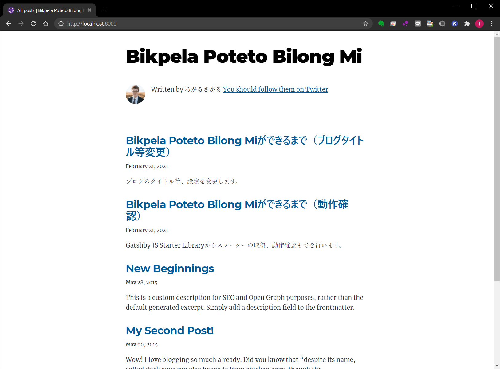

## `gatsby-config.js`の編集

最初はこんな感じ。
```js
module.exports = {
  siteMetadata: {
    title: `Gatsby Starter Blog`,
    author: {
      name: `Kyle Mathews`,
      summary: `who lives and works in San Francisco building useful things.`,
    },
    description: `A starter blog demonstrating what Gatsby can do.`,
    siteUrl: `https://gatsby-starter-blog-demo.netlify.app/`,
    social: {
      twitter: `kylemathews`,
    },
  },
  plugins: [
      // 省略
  ],
}
```

↑を、こんな感じに編集する。
```js
module.exports = {
  siteMetadata: {
    title: `Bikpela Poteto Bilong Mi`,
    author: {
      name: `あがるさがる`,
      summary: ``,
    },
    description: `たまに何か書きます。`,
    siteUrl: `https://sgktmk.com/`,
    social: {
      twitter: `agsg_`,
    },
  },
  plugins: [
      // 省略
  ],
}
```

すると、こんな風になります。


まだアイコンがデフォルトのままだったりプロフィールのうしろにTwitterに誘導する文章が付いていたりで不完全ではありますが、タイトルが変わるだけで雰囲気が全然違います。

次回は、アイコンとかを変えていきます。