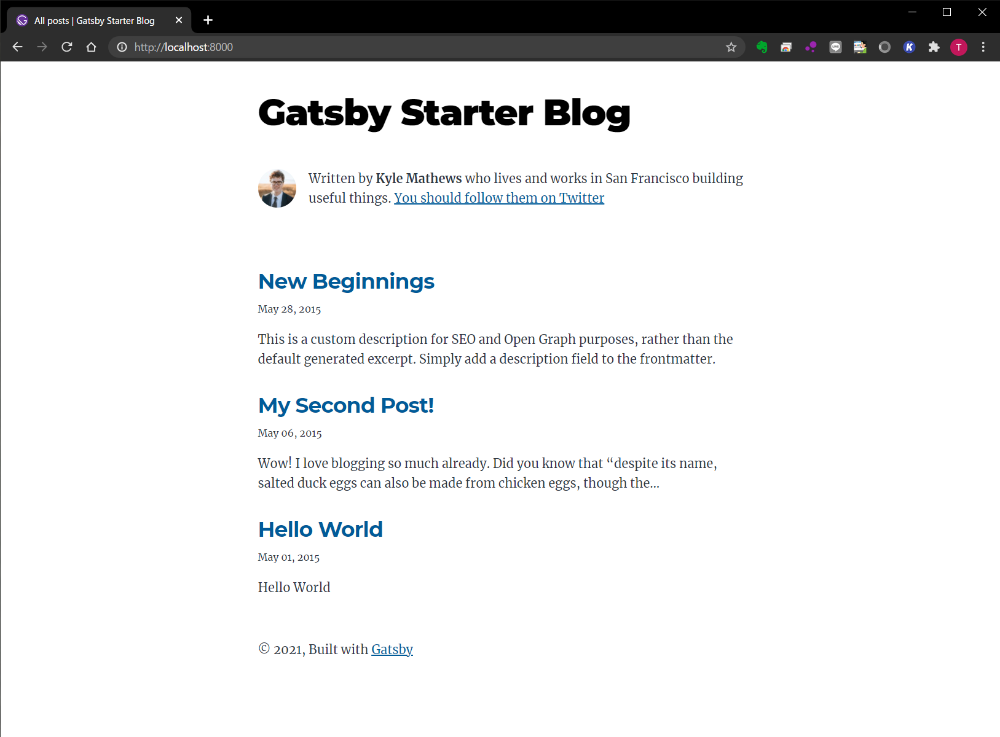

1. [Gatsbyのスターターライブラリ](https://www.gatsbyjs.com/starters/)から、`gatsby-starter-blog`を取得  
```sh
gatsby new bikpera-poteto-bilong-mi https://github.com/gatsbyjs/gatsby-starter-blog
```

1. 作成されたディレクトリに移動  
```sh
cd bikpera-poteto-bilong-mi/
```

1. ローカルリポジトリの初期化  
```sh
git init
```
```sh
git add .
```

1. メールアドレスとユーザ名を設定  
```sh
git config --global user.email [メールアドレス]
```
```sh
git config --global user.name [ユーザ名]
```

1. コミット  
```sh
git commit -m "initial commit"
```

1. リモートリポジトリの作成  
[GitHub](https://github.com/)に移動し、任意の名前でリポジトリを作成します。（今回は、ローカルリポジトリと同じ名称の`bikpera-poteto-bilong-mi`というリポジトリを作成しました。）

1. リモートリポジトリの追加（別途[SSHの設定](https://docs.github.com/ja/github/authenticating-to-github/adding-a-new-ssh-key-to-your-github-account)が必要）  
```sh
git remote add origin git@github.com:[ユーザ名]/bikpera-poteto-bilong-mi.git
```

1. ローカルブランチをリモートリポジトリにpush  
```sh
git branch -M main
```
```sh
git push -u origin main
```

1. 動作確認  
```sh
gatsby develop
```



以上で、動作確認は完了です。